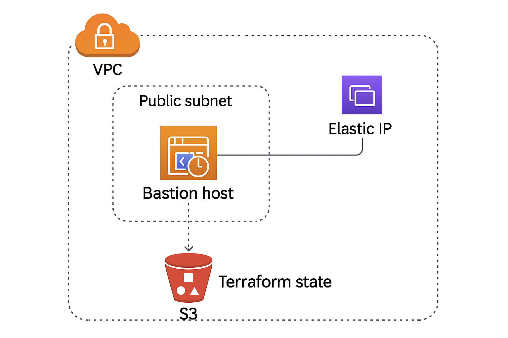

# 🕒 datetime-api test project

A minimalistic API that provides various datetime-related utilities, built with Python and containerized using Docker along with Terraform code to deploy the api. 🚀

---

## 🔧 Tech Stack & Versions

| Tool       | Version       |
|------------|---------------|
| 🐍 Python  | 3.10.x        |
| 🐳 Docker  | 24.x or above |
| 🧪 Flask   | 2.3.x         |

---

## 🚀 Getting Started with Docker

### 📥 Step 0: Clone the Repository

```bash
git clone https://github.com/your-username/datetime-api.git
cd datetime-api
```

### 🧱 Step 1: Build the Docker Image

```bash
docker build -t datetime-api .
```

### 🧪 Step 2: Run the Docker Container

```bash
docker run -d -p 3000:3000 datetime-api
```

> The API will be accessible at: [http://localhost:3000](http://localhost:3000)

---

## 📁 Project Structure

```plaintext
datetime-api/
├── terraofrm/
    └── main.tf
    └── backend.tf
    └── outputs.tf
    └── variables.tf
    └── versions.tf
    └── terraform.tfvars.sample
├── Dockerfile
├── api.py
├── requirements.txt
└── README.md
```

---

## 📁 Project Architecture



---

## 🧠 Features

- 🗓️ Get the current UTC datetime
- ⏱️ Convert timestamp to readable format
- 🔁 Timezone conversions
- 📆 Date difference calculator

---


## 🌍 Running the Terraform Code

The infrastructure configuration for deploying the API is located in the `terraform/` directory.

### 🧰 Prerequisites

Ensure the following tools are installed on your local machine:

| Tool        | Version       |
|-------------|---------------|
| 🛠️ Terraform | >= 1.10.0       |
| ☁️ AWS CLI   | >= 2.21.0      |

### ⚙️ Running the Terraform Scripts

1. Navigate to the Terraform directory:
   ```bash
   cd terraform
   ```

2. Initialize Terraform:
   ```bash
   terraform init
   ```

3. Review the execution plan:
   ```bash
   terraform plan
   ```

4. Apply the configuration:
   ```bash
   terraform apply
   ```

> Make sure your AWS credentials are configured properly before running Terraform commands.

## 🌐 Author

Made with ❤️ by [iamfaseeh](https://github.com/iamfaseeh) 

---